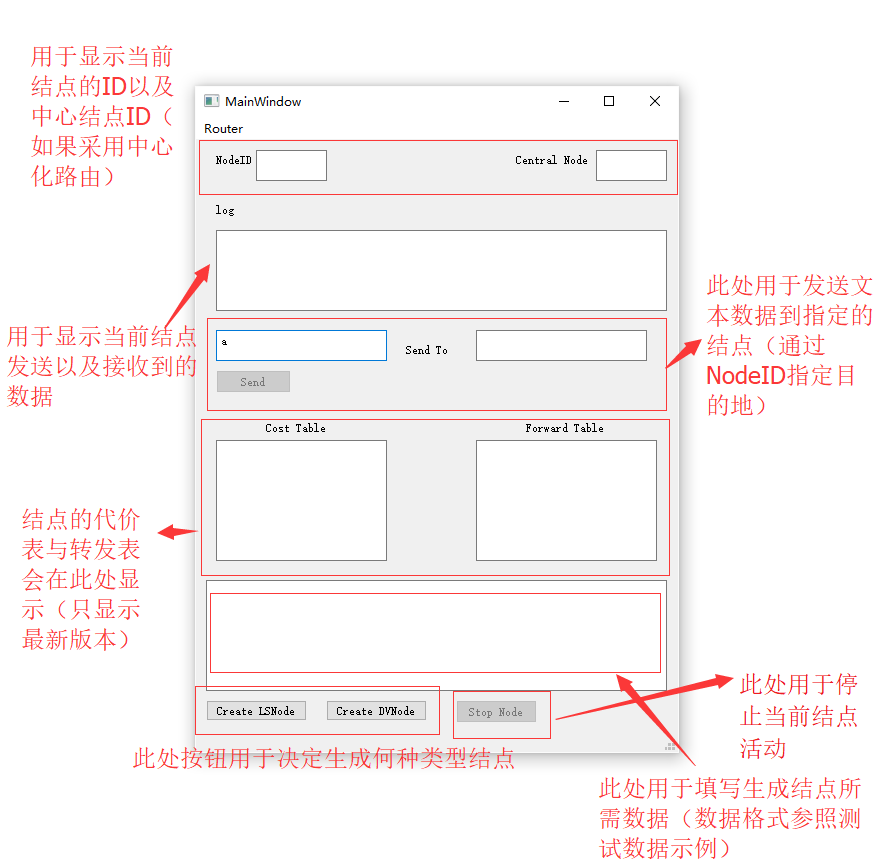
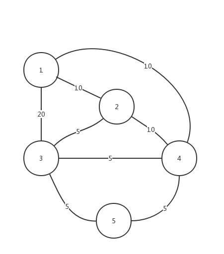

# 虚拟路由实验
# SocketRouter

基于Socket来进行虚拟路由

## 运行方法简述

### 直接运行Python

脚本测试:
```bash
# 在项目根目录下

# 进行动态测试
# 先等待稳定，然后改变一条路径的费用再等待稳定，然后使一个结点宕机再等待稳定
# 第一次稳定结果保存在 first-stable.dump.txt
# 改变费用后结果保存在 cost-change.dump.txt
# 最终状态结果保存在   node-down.dump.txt
python3 -m tests.five_node_test LS dynamic
python3 -m tests.five_node_test DV dynamic
python3 -m tests.five_node_test CLS dynamic

# 测试另一个拓扑
python3 -m tests.five_node_test LS dynamic tests/five_node_test_1


# 进行普通测试
# 只会等待稳定然后关闭 保存在 node-down.dump.txt
python3 -m tests.five_node_test LS simple
python3 -m tests.five_node_test DV simple tests/five_node_test_1

# 进行发送测试
# 广播一个文本信息，单播一个图片信息
# 文本信息会输出在命令行上，图片会保存在命令执行时所在的目录
python3 -m tests.five_node_test LS simple
python3 -m tests.five_node_test DV simple tests/five_node_test_1
```

启动UI:
```bash
# 安装依赖
pip3 install PyQt5

# 由于网络问题可能很难装上，因此可以考虑换用国内镜像
# pip3 install -i https://pypi.tuna.tsinghua.edu.cn/simple PyQt5

# 在 routerUI/ 目录下
python SetUI.py LS
python SetUI.py CLS
```

> 插入UI说明



在最下面的文本框中输入配置信息，然后点击 Create 即可创建结点，配置信息可以直接使用 `tests/five_node_test_0` 目录下的配置。(具体使用可参照视频演示)

### 使用exe

在exe目录下，不选中任何项目的情况下 **按住Shift+鼠标右键** -- 在此处打开命令提示符/Powershell，在里面输入如下的指令

测试脚本:
```bash
# 进行动态测试
# 先等待稳定，然后改变一条路径的费用再等待稳定，然后使一个结点宕机再等待稳定
# 第一次稳定结果保存在 first-stable.dump.txt
# 改变费用后结果保存在 cost-change.dump.txt
# 最终状态结果保存在   node-down.dump.txt
.\five_node_test.exe tests.five_node_test LS dynamic
.\five_node_test.exe tests.five_node_test DV dynamic
.\five_node_test.exe tests.five_node_test CLS dynamic

# 测试另一个拓扑
.\five_node_test.exe tests.five_node_test LS dynamic tests/five_node_test_1


# 进行普通测试
# 只会等待稳定然后关闭 保存在 node-down.dump.txt
.\five_node_test.exe tests.five_node_test LS simple
.\five_node_test.exe tests.five_node_test DV simple tests/five_node_test_1

# 进行发送测试
# 广播一个文本信息，单播一个图片信息
# 文本信息会输出在命令行上，图片会保存在命令执行时所在的目录
.\five_node_test.exe tests.five_node_test LS simple
.\five_node_test.exe tests.five_node_test DV simple tests/five_node_test_1
```

启动UI

```bash
.\SetUI.exe LS
.\SetUI.exe CLS
```

## 基础项目信息

### 结点配置文件

```plain
{
  "name": String,
  "node_id": Number,
  "ip": "$ip",
  "port": $port,
  "topo": {
    "$node_id": {
      "real_ip": "$ip",
      "real_port": $port,
      "cost": Number
    }
  }
}
```

### 协议

换行符使用 `\n` 而非 `\r\n`

基本协议形式

```plain
SRC_ID $源结点NODE_ID
DST_ID $目标结点NODE_ID，-1表示广播 $序列号，如果是广播需要序列号进行受控洪泛
$数据包类型(DATA/ROUTE/BEAT) $携带数据类型(TXT/JPEG/PNG/...)/$使用的算法模式(LS/DV)/$心跳(BEAT)
$数据，支持二进制
```

#### DATA类型

文本：
```plain
SRC_ID 0
DST_ID 1
DATA TXT
Hello world, and this is the raw text data.
Feel free to use \n or \r\n here. It only depends on your application.
甚至可以写中文。
```


#### ROUTE类型

##### LS模式路由信息

广播自身的邻居情况：
```plain
SRC_ID 0
DST_ID -1 132
ROUTE LS
$NODE_ID_0 $LINK_COST_0
$NDOE_ID_1 $LINK_COST_1
...
```

##### DV模式路由信息

向邻居发送自身的邻居情况
```plain
SRC_ID 0
DST_ID 1
ROUTE DV
$NODE_ID_0 $LINK_COST_0
$NDOE_ID_1 $LINK_COST_1
...
```

##### CLS模式路由信息

向普通结点发送已计算的转发表
```plain
SRC_ID 0
DST_ID -1 132
$NODE_ID_0 $NODE_ID_TO_0 $NODE_ID_VIA_0
$NODE_ID_0 $NODE_ID_TO_1 $NODE_ID_VIA_0
...
```

##### 请求路由信息

向邻居发送路由信息请求
```plain
SRC_ID 0
DST_ID 1
ROUTE REQ
REQ
```

#### BEAT类型

广播心跳信息：
```plain
SRC_ID 0
DST_ID -1 123
BEAT BEAT
ALIVE
```

### 项目逻辑

#### 总述

项目使用Python3代码编写，基于 **UDP协议** 进行路由信息交换

+ 结点: 一个虚拟路由结点
  + 一台物理的机器上可以部署不止一个虚拟结点，在本项目中，(IP, port) 可作为一个结点的唯一标识。即，在同一台物理机器上，可以部署多个虚拟结点，只需要配置不同端口即可。
+ node id: 用作结点的唯一标识，可类比真实网络中的IP
  + 虽然 (IP, port) 也是唯一标识，但为方便起见，增加一个node id来替代 (IP, port)


根据面向对象的思想，使用了 **类** 的概念。本例中，有5个类：

+ `BaseRouteNode` 包含一个路由结点的基础功能，包括基础的协议解析、发送/接收数据、宕机检测、心跳包管理等功能
+ `LSRouteNode` 继承 `BaseRouteNode` 包含LS路由结点的功能，会对 `BaseRoute` 进行一定特化
+ `DVRouteNode` 继承 `BaseRouteNode` ，包含DV路由结点的功能，会对 `BaseRoute` 进行一定特化
+ `CentralNode` 继承 `LSRouteNdoe`，包含在有中心控制器时，中心控制器的功能
+ `CentralNormalNode` 继承 `LSRouteNdoe`，包含在有中心控制器时，普通节点的功能

当数据包到达时，会由 `BaseRouteNode` 的成员方法接收并将报文内容根据协议转为python中的 **字典(dict)**，再根据在该字典中的值判断报文属于哪一类型，根据类型再转到恰当函数中处理：如路由信息，转到各个类中实现的 `route_obj_handler` 处理；数据信息，转到 `data_obj_handler` 进行处理等。

#### 算法部分
对于非中心结点，有LS（链路状态）与DV（距离向量）两种结点，对应使用了相应算法，算法主体代码如下:
##### LS算法
```python
def ls_algo(source_node_id, topo, forward_table):
    if len(topo) == 0:
        return
    # 如果接受的topo图为空则直接不做任何运算
    if source_node_id in topo:
        pass
    else:
        return
    # 如果当前结点不在topo图中则不做运算
    N_ = set()
    N_.add(source_node_id)
    D = {}  # D[u]代表从源结点到目的结点的代价
    p = {}  # p[u]代表结点u的上一个结点
    nodes = set()
    for key, val in topo.items():
        for k, v in val.items():
            nodes.add(key)
            nodes.add(k)
    for n in nodes:
        if n in topo[source_node_id]:
            D[n] = topo[source_node_id][n]
            p[n] = source_node_id
        else:
            D[n] = sys.maxsize
    D[source_node_id] = 0
    while len(N_) != len(nodes):
        tmp_list = sorted(D.items(), key=lambda asd: asd[1])
        for k, v in tmp_list:
            if k not in N_:
                N_.add(k)
                if k in topo:
                    for key, val in topo[k].items():
                        if (topo[k][key] + D[k] < D[key]):
                            p[key] = k
                            D[key] = topo[k][key] + D[k]
                break
    '''
    上述代码部分采用课件LS算法的伪代码直接进行编写:
      1 Initialization:
      2 N' = {u}
      3 for all nodes v
      4 if v adjacent to u
      5 then D(v) = c(u,v)
      6 else D(v) = ∞
      7
      8 Loop
      9 find w not in N' such that D(w) is a minimum
      10 add w to N'
      11 update D(v) for all v adjacent to w and not in N' :
      12 D(v) = min( D(v), D(w) + c(w,v) )
      13 /* new cost to v is either old cost to v or known
      14 shortest path cost to w plus cost from w to v */
      15 until all nodes in N'
    '''
    forward_table.clear()
    for k, v in p.items():
        if v != source_node_id:
            tv = v
            while tv in p and p[tv] != source_node_id:
                tv = p[tv]
            forward_table[k] = tv
        elif v != k:
            forward_table[k] = k
    forward_table[source_node_id] = source_node_id
    return D
    # 通过p表, 不停的向上遍历,为每一个目标结点生成相应的转发项
```
##### DV算法
```python
def dv_algo(self,other_node_id, other_cost_table, source_cost_table, forward_table):
    changeFlag = False
    for k,v in [i for i in forward_table.items()]:
        if v == other_node_id and k not in other_cost_table and k != other_node_id:
            if k in self.down_check_table and not self.down_check_table[k]['downed']:
                source_cost_table[k] = self.down_check_table[k]['origin_cost']
                forward_table[k] = k
            else:
                source_cost_table.pop(k)
                forward_table.pop(k)
            changeFlag = True
        '''
        上述代码作用为排除已经down掉的结点,自然语言描述如下:
          当当前结点转发表中有一个目标结点需要通过传进来的邻居结点转发,
          但是此时邻居结点的费用表中已经没有了到达目标结点的费用,那么,
          首先我们要确定那个结点是不是真的不可达(有可能某个结点down掉
          导致其不可达),所以我们检查自己的邻居看我们能不能直接到达该点
          ,能则更新我们相应的费用表与转发表,否则则将其从费用表与转发表
          中删除
        '''
        if v == other_node_id and k in other_cost_table and k != other_node_id and k in source_cost_table:
            if other_cost_table[k]+source_cost_table[other_node_id] != source_cost_table[k]:
                source_cost_table[k] = other_cost_table[k]+source_cost_table[other_node_id]
                changeFlag = True
        '''
        上述代码作用为更新变化的链路代价,自然语言描述如下:
          如果原本我们经过邻居结点到达某一个目标结点,而邻居结点到达
          该结点的代价由于某种原因发生了变化,那么此时我们需要更新相
          应的代价
        '''
    
    for k,v in other_cost_table.items():
        if k not in source_cost_table or source_cost_table[k] > source_cost_table[other_node_id] + other_cost_table[k]:
            source_cost_table[k] = source_cost_table[other_node_id] + other_cost_table[k]
            if other_node_id in forward_table:
                forward_table[k] = forward_table[other_node_id]
            else:
                forward_table[k] = other_node_id
            changeFlag = True
    forward_table[self.node_id] = self.node_id
    '''
    上述代码计算代价的部分便是DV算法伪代码翻译过来的,
    这里需要说明的是转发表的计算:我们需要确定,我们是
    不是能通过别的邻居结点更优的到达此时参与运算的邻
    居结点,如果可以,那么我们的转发表便需要使用那个邻
    居结点作为转发项,否则则使用当前邻居结点
    '''
    return changeFlag

```

对于中心控制的情况,显然其也是采用的LS算法根据topo图进行计算,只是说需要在计算中通过更换源结点来计算出对应的费用表与转发表.因此在此处不再做多余的赘述


#### 代码设计

本项目的核心代码 `route_node.py` 致力于提供尽可能简单的接口，使用户能方便地使用

简单例子：

```python
import route_node
import time

def obj_handler(node_instance, data_obj):
    print("Recved {} data from {}. Data:\n{}".format(data_obj['data_type'], data_obj['src_id'], data_obj['data']))

node = route_node.DVRouteNode('config.json', obj_handler=obj_handler, name='SimpleNode')

node.start()

node.send({
  'packet_type': BaseRouteNode.PACKET_DATA,
  'data_type': BaseRouteNode.DATA_TXT,
  'data': "Hello guys!"
}, -1) # 广播

time.sleep(5)

node.stop()
```

#### 路由信息处理

因类型(DV或LS)的不同，会有不同的路由信息处理策略

##### LS

LS结点的路由信息是：该结点的相邻结点及其链路费用

此处描述LS结点的逻辑：

1. start时，广播一个 **路由信息请求包**(用于获取当前拓扑信息)，并广播一个自身路由信息(包含自身的邻居结点情况)
2. start后，开始侦测数据包的接收情况
3. 接收到路由信息，根据路由信息修改自身当前保存的全局拓扑图，若拓扑图更新，则调用LS算法计算新的费用表和转发表
4. 定时广播自身信息、检查宕机情况，继续侦测数据包接收情况(回到3.)

##### DV

DV结点的路由信息是：当前所知的，到达邻居结点的最低费用

此处描述DV结点的逻辑

1. start时，向邻居发送一个 **路由信息请求包**(用于请求邻居向外发送器路由信息)，并向邻居发送自身路由信息(包含当前所知的到达邻居结点的最低费用)
2. start后，开始侦测数据包的接收情况
3. 接收到路由信息，根据路由信息直接调用DV算法计算新的费用表和转发表
4. 定时广播自身信息、检查宕机情况，继续侦测数据包接收情况(回到3.)

##### CLS (Center LS)

1. start时，广播一个 **路由信息请求包**(用于获取当前拓扑信息)，并广播一个自身路由信息(包含自身的邻居结点情况)
2. start后，开始侦测数据包的接收情况
3. 所有结点广播链路信息,控制节点接受并计算转发表
4. 控制节点广播转发表,非控制节点接受转发表并更新自身转发表
5. 定时广播自身信息、检查宕机情况，继续侦测数据包接收情况(回到4.)

#### 路由广播策略

参考一般的网络中使用一个特殊IP(子网掩码为0的位置全为1)作为广播地址，本项目中采用特殊的node_id **-1** 作为 “广播地址”。

在本项目中，广播应用于：心跳包、LS路由信息，当然，也可以向 **-1** 发送DATA类型数据，达到广播效果。

#### 广播控制策略

用到广播，就需要考虑如何避免重复广播甚至广播风暴。本项目中的实现是，通过在广播包中添加序列号来区别已收到广播和未收到广播，以此来判断是否接收并向下传递广播包，达到受控洪泛的效果。

在实现中，每个node\_id都会存有一个已接收并传递的序列号表，当某序列号超时之后，该node\_id发送的，带有此序列号的广播包才会被再次接收并传递。

## 运行示例
### 测试1
#### 测试拓扑图

边上数字代表链路代价
#### 测试数据
测试数据请查看:
 `tests/five_node_test_0` 
预计结果请查看:
 `tests/five_node_test_0/expected.txt`
#### 实际运行效果
##### LS测试
初始条件计算稳定后结果请查看:
`docs/assets/test0/LS/first-stable.dump.txt`

改变链路代价(3与1之间的链路代价被设置为2)请查看:
`docs/assets/test0/LS/cost-change.dump.txt`

基于改变链路代价的条件下,结点2down掉:
`docs/assets/test0/LS/node-down.dump.txt`

##### DV测试
初始条件计算稳定后结果请查看:
`docs/assets/test0/DV/first-stable.dump.txt`

改变链路代价(3与1之间的链路代价被设置为2)请查看:
`docs/assets/test0/DV/cost-change.dump.txt`

基于改变链路代价的条件下,结点2down掉:
`docs/assets/test0/DV/node-down.dump.txt`

##### CLS测试
初始条件计算稳定后结果请查看:
`docs/assets/test0/CLS/first-stable.dump.txt`

改变链路代价(3与1之间的链路代价被设置为2)请查看:
`docs/assets/test0/CLS/cost-change.dump.txt`

基于改变链路代价的条件下,结点2down掉:
`docs/assets/test0/CLS/node-down.dump.txt`

